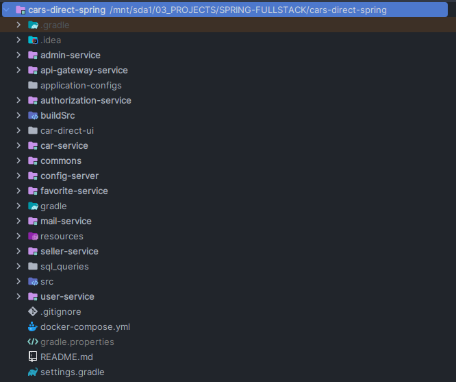
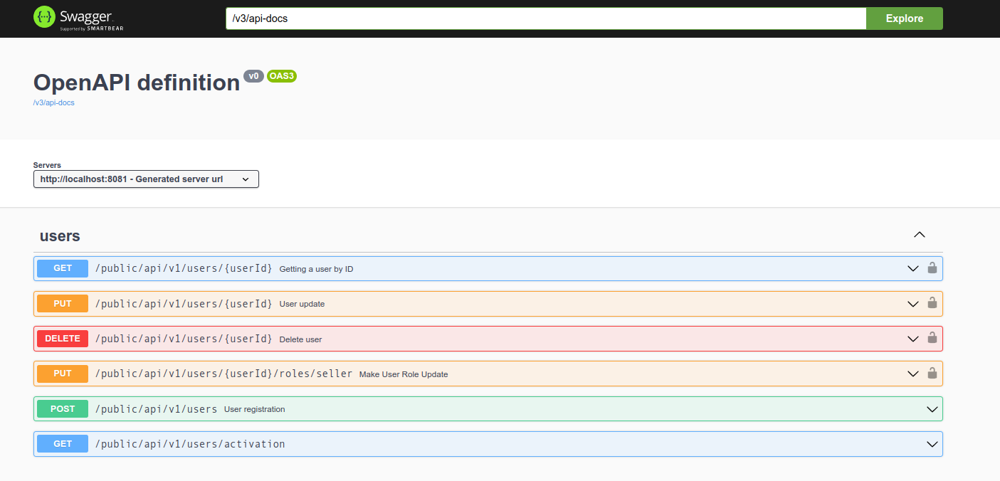
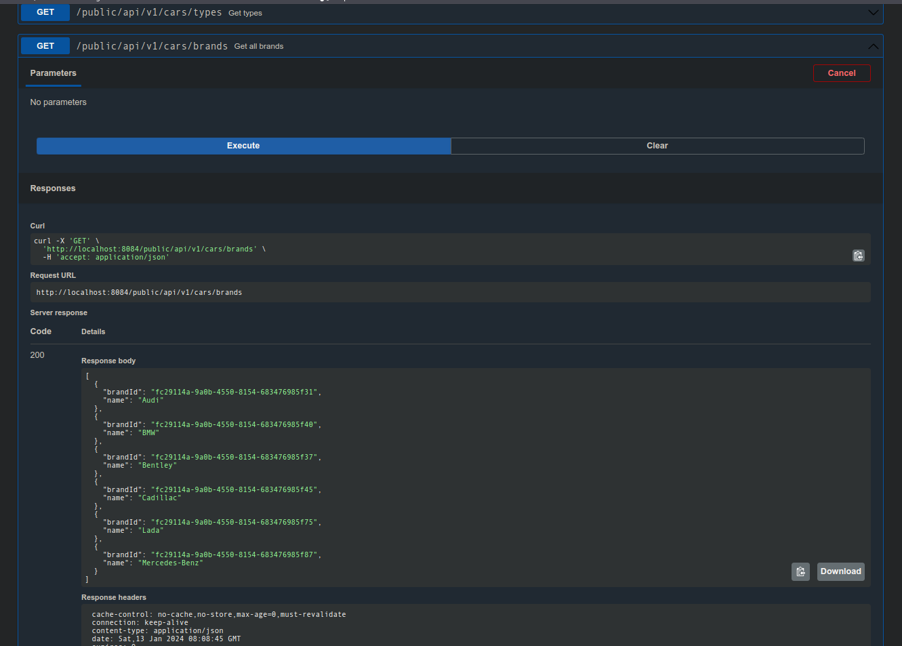

# CARs DIRECT

Приложение Car Direct предоставляет следующие возможности:

- Поиск автомобилей по параметрам
- Сравнение автомобилей
- Оформление сделки купли-продажи

## Технологии

Backend: 
- Spring Boot (Data, Security, ...), Java 17, Postgresql 15, docker, Kafka, Redis, JWT, ...

~~Frontend: React, TS, HTML, CSS, Webpack~~

## Превью

### Создание нового пользователя через user-service (по api-gateway-service)

На данном этапе создаётся запись в БД для данного пользователя, а также токен для активации.

Пользователь может работать с пользовательской системы только после этапа акцивации пользователя.

## Активация через mail-service (по api-gateway-service, связь с user-service c WebClient класса)

## Созданные пользователи (через Postgres из Docker Container)

## Получение токена пользователя (для работы с пользователем) - authorization-service

Позволяет создавать токен, который пригодится для всех операций, которые должны быть доступны только для авторизованного
пользователя или пользователя с определённым статусом.

Например, выставить на продажу автомобиль может только пользователь с ролью SELLER.

## Получение статуса продавца (связь через Kafka MQ между user-service и seller-service)

### Отправка

### Принятие

## Асинхронное взаимодействие с использованием реактивного программиварония

## Docker

## Создание автомобиля

## SWAGGER

## Описание

- ✅ 1. Написать монолит с 5-10 доменными сущностями (интернет магазин, CRM система, или т.п.), желательно придерживаться Clean Architecture. (yes)
- ✅ 2. Попилить на микросервисы 
- ✅ 3. Обернуть в докер контейнеры (jib)
- ✅ 4. Реализовать пример оркестрации или хореографии (docker + k8s)
- ✅ Реализовать пример асинхронного взаимодействия между сервисами
- ✅ 6. Подключить шину данных (Rabbit MQ)
- ✅ 7. Авторизация и аутентификация через единый микросервис авторизации (api-gateway-service)
